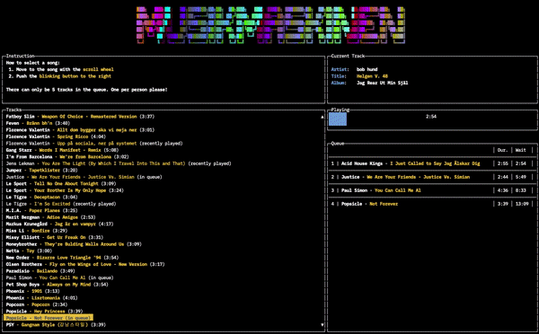
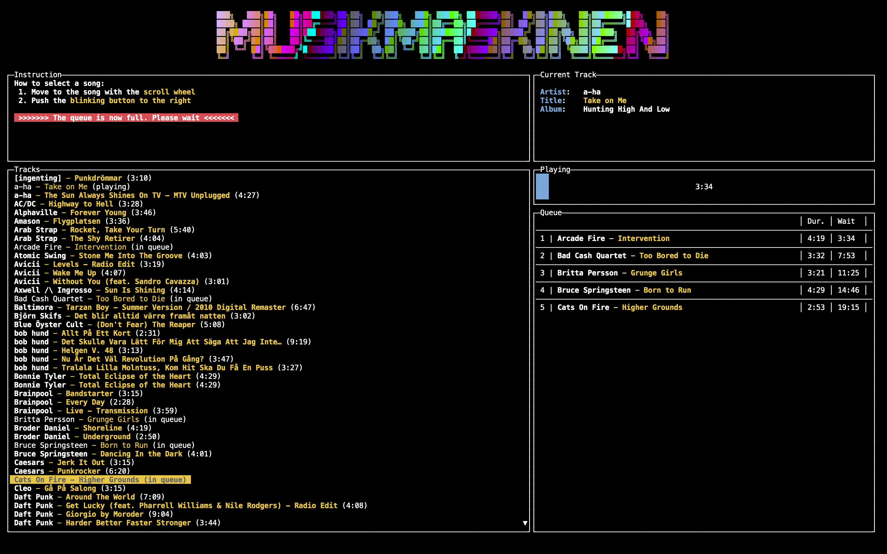

## Musikmaskinen
**The only music machine your party needs**

# Overview
Musikmaskinen is software and hardware that acts as a crowd sourced DJ for your party. In essence, it;

* Allows people to queue songs using a very simplified UI
* Uses a hardware controller with only a scroll wheel for selecting songs and a single button to queue 
* Only allows selecting songs from a pre-determined list of songs
* Only allows a certain number of songs to be queued (5 by default). 

# WHY?

Great that you asked! 

Musikmaskinen was inspired by a similar piece of software used at an indie club called Metropolis in the early 00's. I've recreated it several times since then, but this specific version of the software (and hardware) was created for my friend Rickard's 40th party. 

However, I've also been craving software like this for essentially every DJ-less party I've been to, ever. Usually music choices are either decided by a fixed playlist (boooo!) or by an open Spotify playlist (filled by hundreds of songs in the first minutes = booo!).

Having a fixed queue size also creates a social spot around the machine when people are waiting for a queue slot to open up. The UI is also intended to clearly show:

1. What song is currently playing
2. What songs are queued, and;
3. How long until a queued song starts playing. I.e, is there time for a bathroom break before Justice vs Simian starts playing.

# Getting Started
1. Clone this repository
2. `go build .`
3. Create an application at the [Spotify Developer Dashboard](https://developer.spotify.com/dashboard)
4. Figure out the Playlist ID for your playlist with the pre-approved songs. Find the playlist URI and use only the last part of it (i.e. for `spotify:user:1185903410:playlist:6YAnJeVC7tgOiocOG23Dd` use `6YAnJeVC7tgOiocOG23Dd`). This playlist must currently be owned by whomever you log in as.
5. `./musikmaskinen --client-id=<my spotify client id> --client-secret=<my spotify client secret> --spotify-curated-playlist=<id>`
6. A browser window will appear asking you to authenticate with Spotofy. Log in as yourself.
7. Make sure that you have a spotify device active. I.e. start and stop a song in a spotify player somewhere to make it active.

## Navigation
- <kbd>&uarr;</kbd> and <kbd>&darr;</kbd> to select a song
- <kbd>↵</kbd> (Enter) to queue song
- <kbd>D</kbd> to delete the latest added item in the queue
- <kbd>S</kbd> to skip the current playing song. Note that this can take up to ten seconds.

# Software

The software is written in Go and uses the Spotify web API to play songs. Any Spotify connected device can be used to play the songs, so it should be compatible with everything that can play Spotify, essentially. Currently you do need a developer account with Spotify to create a Oauth Client ID and client secret.

Do note that this code is pretty rough. I had a very limited time to get things running before the party. With that said, I still wanted to open-source it as soon as possible.

## Todo
- [ ] Clean up the UI code (currently everything resides in `main.go`)
- [ ] Create a web service so that users don't need their own oauth secrets
- [ ] Create an alternative UI, possibly as a web interface

# Hardware
The hardware is based on a simple Arduino with a rotary encoder and a buttton. There's support for a LED in the button that blinks whenever the queue is empty. 

The hardware ("controller") uses a very simple serial protocol to communicate with the software.

Do note that I'm not really an electronics person, so feel free to improve the hardware and make it cheaper and more robust.

## License

Apache 2.0

**note** The font `ansi_shadow.flf` used by the animated header has an unclear license status. It seems to be from the 90's. If you object to that file and derivatives being a part of this repository, please contact me. 
